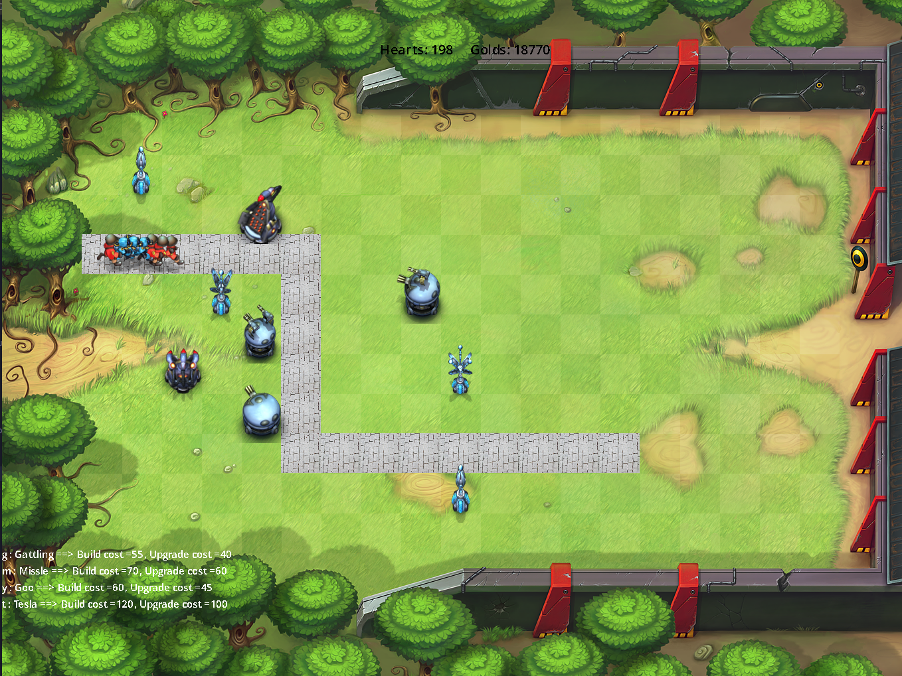

# Field-Runner-Game
How to run: 
1- first edit the project path in Variables.cpp 
2- make 
3- ./myFieldRunner.out  
4- first input line is the path of troops and the other lines are number of each type of troop in attack waves.  
input example:  
0 3 1 3 2 3 3 3 4 3 5 3 5 4 5 5 5 6 5 7 5 8 6 8 7 8 
3 1 1 1  
1 1 4 1  
10 0 0 0  
0 10 1 0  
0 0 10 0  
0 0 0 10  
 
 

 

